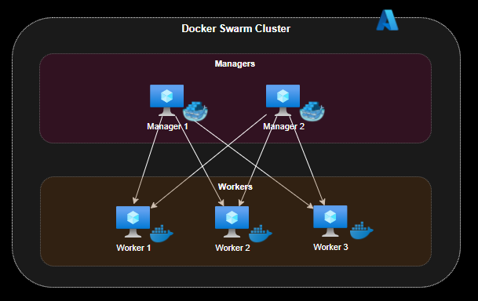

# Docker Swarm with Ansible

Code to provision and configure a Docker Swarm cluster on Azure Cloud using Ansible playbooks.

## Swarm




## Running it

Log in to Azure Cloud Shell and run the playbooks:

```sh
ansible-playbook playbook.yml
```

If you prefer to run locally then install the required dependences:

```sh
python3 -m venv env
. env/bin/activate
pip install --upgrade pip
pip install -r https://raw.githubusercontent.com/ansible-collections/azure/dev/requirements-azure.txt
pip install 'ansible'
```

## Sources

[Ansible Azure Guide](https://docs.ansible.com/ansible/latest/scenario_guides/guide_azure.html)

[Ansible Azure modules](https://docs.ansible.com/ansible/2.9/modules/list_of_cloud_modules.html#azure)

[Azure Ansible Quickstart](https://docs.microsoft.com/en-us/azure/developer/ansible/vm-configure?tabs=ansible#complete-sample-ansible-playbook)

[Reuse playbooks](https://docs.ansible.com/ansible/latest/user_guide/playbooks_reuse.html)

