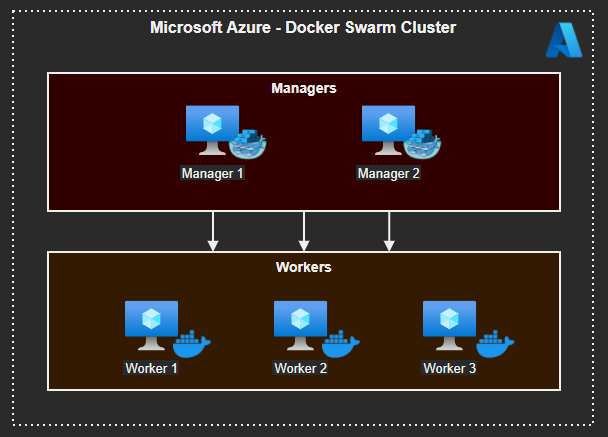

# Docker Swarm with Ansible

Code to provision and configure a Docker Swarm cluster on Azure Cloud using Ansible playbooks.

:construction: Under Construction :construction:

- [x] Azure provisioning
- [ ] Docker Engine
- [ ] Swarm Cluster

## Swarm




## Running it

Log in to Azure Cloud Shell and run the playbooks:

```sh
ansible-playbook src/provision.yml \
    --extra-vars '{"instance":"development","ssh_key_file_path":"~/.ssh/id_rsa.pub"}'
```

Edit Ansible inventory (TODO)

Install Docker:

```sh
ansible-playbook src/install-docker-playbook.yml -l remote
```

### Local Ansible

Optionally, you may want to run Ansible locally.

```sh
python3 -m venv env
. env/bin/activate
pip install --upgrade pip
pip install -r https://raw.githubusercontent.com/ansible-collections/azure/dev/requirements-azure.txt
pip install 'ansible'
```

## Sources

[Ansible Azure Guide](https://docs.ansible.com/ansible/latest/scenario_guides/guide_azure.html) | [Ansible Azure collections](https://docs.ansible.com/ansible/latest/collections/azure/azcollection/index.html) | [Azure Ansible Quickstart](https://docs.microsoft.com/en-us/azure/developer/ansible/vm-configure?tabs=ansible#complete-sample-ansible-playbook) | [Reuse playbooks](https://docs.ansible.com/ansible/latest/user_guide/playbooks_reuse.html) | [Run Ansible in Parallel](https://toptechtips.github.io/2019-07-09-ansible_run_playbooks_tasks_in_parallel/) | [Install docker remotely with Ansible](https://www.rechberger.io/tutorial-install-docker-using-ansible-on-a-remote-server/)